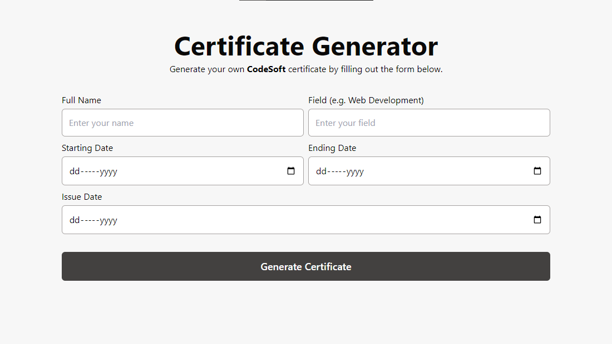

# 🎓 Certificate Generator



A Certificate Generator built using React, TypeScript, Tailwind CSS, and React-PDF. It was created for fun and as a learning exercise. The application allows users to generate internship certificates easily.

## 🚀 Live Preview

You can view a live preview of the project [here](https://certificate-generator-live.netlify.app/).

## 💻 Tech Stack


## ⚙️ Installation

To get started with the project, follow these steps:

1. Clone the repository:
    ```bash
    git clone https://github.com/sahilatahar/certificate-generator.git
    ```
2. Navigate to the project directory:
    ```bash
    cd certificate-generator
    ```
3. Install the dependencies:
    ```bash
    npm install
    ```
4. Start the development server:
    ```bash
    npm run dev
    ```
5. Open the project in your browser:
    ```bash
    http://localhost:5173
    ```

## 📜 License

This project is open source and available under the [MIT License](LICENSE).

## 📝 Note

This project was built for fun and learning purposes.
